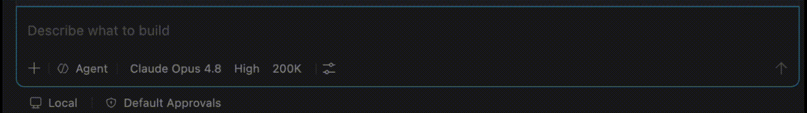

# BA-Kit

> A spec-driven, agent-agnostic framework for **Business Analysts** — clone it, run one
> installer, then drive everything from inside your AI assistant.

[](LICENSE)
[](CHANGELOG.md)
[](#supported-environments)
[](#supported-environments)

BA-Kit turns ideas, notes, and documents into structured, review-ready Markdown artifacts —
requirements, user stories, and shareable pages — by giving your AI assistant a set of **guided BA
activities** ("skills") and a **standard, organized workspace**. Skills are plain Markdown, so the
same framework works across multiple AI assistants and IDEs.

Inspired by [spec-kit](https://github.com/github/spec-kit), but for **BA activities** instead of
software features.

## See it in action

Driving the default flow from inside the AI assistant — slashing between `ba.start-project`,
`ba.start-task`, `ba.analyze-docs`, `ba.specify`, and `ba.render-confluence`:



## New here? Start with the docs

| If you want to… | Read |
|-----------------|------|
| Understand the terms (no jargon) | **[Concepts & glossary](docs/concepts.md)** |
| Install and create your first project | **[Getting started](docs/getting-started.md)** |
| Learn the everyday BA flow | **[Working with the default workflow](docs/workflows.md)** |
| Run the consultative idea-to-roadmap process | **[Discovery workflow (advanced)](docs/discovery.md)** |
| See a finished project before you start | **[Worked example](examples/README.md)** |
| Look up a specific skill | **[Skills reference](skills/README.md)** |
| Fix a problem | **[FAQ & troubleshooting](docs/faq.md)** |

## Quickstart

Use this if you already have `git` and your assistant installed. If you're starting from scratch,
use **Full Installation (Fresh Start)** below.

```sh
# 1. Download
git clone https://github.com/aplakhotnik/bakit.git
cd bakit

# 2. Install (one time) — connects the skills to your AI assistant
./install.sh            # macOS / Linux
# .\install.ps1         # Windows (PowerShell 7+)
```

Then, **from inside your AI assistant**, drive the flow by typing `/` commands:

```text
/ba.start-project   # "Start a project called payments-revamp"
/ba.start-task      # "Add a task: elicit-requirements"
#   → drop notes/documents into the task's inputs/ folder
/ba.next            # asks the workflow what to run next, then you pick the suggestion
#   → e.g. /ba.analyze-docs → /ba.specify → /ba.write-stories → /ba.render-confluence
```

Full walkthrough with expected output: **[Getting started](docs/getting-started.md)**.

> **VS Code (Copilot):** after installing, reload the window and trust the folder so the `/ba.*`
> commands appear. See the [FAQ](docs/faq.md) if they don't.

## Full Installation (Fresh Start)

If this is your first time using BA-Kit (or even your first time using these tools), use this path.
This section focuses on the two setups used most in practice: **VS Code (Copilot)** and
**Antigravity IDE**.

### 1. Install prerequisites

- **git** (required)
  - macOS: `xcode-select --install`
  - Windows: install Git for Windows from https://git-scm.com/download/win
  - Linux: install from your distro package manager (for example, `sudo apt install git`)
- **One IDE/assistant**
  - **VS Code + GitHub Copilot** (recommended for most users)
  - **Antigravity IDE**
- **Terminal**
  - macOS/Linux: built-in terminal
  - Windows: PowerShell 7+ (`pwsh`)

### 2. Clone BA-Kit

```sh
git clone https://github.com/aplakhotnik/bakit.git
cd bakit
```

### 3. Install for VS Code (Copilot) first

```sh
./install.sh --agent copilot            # macOS / Linux
# .\install.ps1 -Agent copilot         # Windows (PowerShell 7+)
```

After install in VS Code:

- Reload window: Command Palette -> `Developer: Reload Window`
- Trust folder if prompted
- Open Copilot Chat, type `/`, verify commands like `/ba.start-project`

### 4. Install for Antigravity

Workspace scope (recommended when starting):

```sh
./install.sh --agent antigravity --scope workspace
# .\install.ps1 -Agent antigravity -Scope workspace
```

Global scope (all projects on your machine):

```sh
./install.sh --agent antigravity --scope global
# .\install.ps1 -Agent antigravity -Scope global
```

### 5. Verify both setups

- **VS Code**: `.github/prompts/ba.start-project.prompt.md` exists
- **Antigravity (workspace scope)**: `.agents/skills/ba.start-project/SKILL.md` exists
- **Antigravity (global scope)**: `~/.gemini/config/skills/ba.start-project/SKILL.md` exists

If you want other assistants later (Claude/Cursor/Generic), re-run installer with `--agent` (or
`-Agent`) for each target.

## What you get

- **Agent-driven, guided flow** — start work by invoking skills, not by running scripts.
- **Standardized workspace** — `Project → numbered Task → inputs / artifacts / deliverables`, each
  with a two-level knowledge base (`kb/`).
- **Agent-agnostic BA skills** that produce structured Markdown artifacts:
  - `ba.specify` — a described *need* or raw notes → structured requirements (deep or quick mode).
  - `ba.analyze-docs` — existing documents → extracted requirements, gaps, open questions.
  - `ba.decompose` *(optional)* — approved requirements → a shape-aware **story map** (backbone,
    prioritized slices, MVP/walking-skeleton, dependencies). Suggested, never required.
  - `ba.write-stories` — approved requirements → user stories with acceptance criteria (consuming
    the story map when one exists).
  - `ba.render-confluence` — approved artifact → local Confluence-ready Markdown.
- **Review gates & traceability** — every artifact carries `status: draft → approved` and provenance
  in YAML front-matter; nothing flows forward until you approve it.
- **Two-level knowledge base** — shared project `kb/` + per-task `kb/` so the AI reuses known facts
  instead of re-asking.
- **Helper scripts** (POSIX shell + PowerShell, full parity) the skills run on your behalf — or that
  you can run directly.
- **A separate, advanced [Discovery workflow](docs/discovery.md)** — a consultative BA/PO state
  machine that turns a plain idea into an estimated, road-mapped backlog.

See **[Working with the default workflow](docs/workflows.md)** for the day-to-day narrative.

## The workflows

- **Default chain** (most BA work): `ba.analyze-docs → ba.specify → ba.write-stories →
  ba.render-confluence`, with an optional `ba.decompose` (story map) step suggested between
  `ba.specify` and `ba.write-stories`. Declared in [`workflow.md`](workflow.md). `ba.next` reads this
  manifest plus your current artifacts to tell you what's runnable now and which artifact must be
  approved first.
- **Discovery** (advanced, separate): a four-state consultative process declared in
  [`workflow-discovery.md`](workflow-discovery.md). It coexists with the default chain and never
  auto-triggers it. See **[docs/discovery.md](docs/discovery.md)**.

## Supported environments

Every BA skill and helper script works identically across the agent × OS matrix below. The
PowerShell helpers under `scripts/ps/` mirror the POSIX shell helpers one-for-one (same commands,
exit codes, and byte-identical output).

| Agent / IDE         | macOS / Linux (`install.sh`) | Windows (`install.ps1`) | Install location                          |
| ------------------- | :--------------------------: | :---------------------: | ----------------------------------------- |
| VS Code (Copilot)   | ✅ | ✅ | `.github/prompts/*.prompt.md`                            |
| Claude              | ✅ | ✅ | `.claude/commands/*.md`                                  |
| Cursor              | ✅ | ✅ | `.cursor/commands/*.md`                                  |
| Generic             | ✅ | ✅ | `.bakit/skills/*.md`                                     |
| Antigravity IDE     | ✅ | ✅ | `.agents/skills/<skill>/SKILL.md` (or global `~/.gemini/config/skills/`) |

The install locations are **generated** from `skills/` and are git-ignored — edit the source under
`skills/` and re-run the installer. For the interactive menu, flags (`--agent`, `--scope global`),
and auto-detection precedence, run `./install.sh --help` (or `.\install.ps1 -Help`); details are in
**[Getting started](docs/getting-started.md)** and the **[FAQ](docs/faq.md)**.

## Upgrading BA-Kit

BA-Kit upgrades the **whole package** — you take a newer `bakit/` and re-run the installer. Your own
work is never touched: project folders, task inputs/artifacts/deliverables, and any installed command
you hand-tuned are **backed up before** they are replaced (never silently overwritten).

**Preview first (recommended).** Every run starts with a short preview of what will change. To see
that preview *without writing anything*, use the dry-run flag:

```sh
./install.sh --check          # macOS / Linux — preview only, makes no changes
.\install.ps1 -Check          # Windows (PowerShell 7+)
```

If nothing you installed differs from the new package, the preview reports **"safe to upgrade"**.
Otherwise it lists exactly which files differ and will be backed up.

**Clone flow** (you cloned the repo):

```sh
cd bakit
git pull                      # get the newer package
./install.sh                  # re-run the installer (or .\install.ps1)
```

**Download flow** (you downloaded a copy): replace your old `bakit/` folder with the new one, then
re-run the installer from inside it.

### Backups & restore

When the installer is about to overwrite a command you tuned, it first copies the existing file —
verbatim — into a timestamped backup folder at the workspace root, then writes the new version live:

```text
.bakit-backup/
└── 20250101T120000Z/                     # UTC run timestamp (colon-free)
    └── .github/prompts/ba.next.prompt.md  # your tuned copy, mirrored install path
```

The end-of-run report tells you how many files were backed up and the folder location. `.bakit-backup/`
is added to your `.gitignore` automatically. **To restore**, copy the file back from the mirrored path
inside the timestamped folder to its install location, e.g.:

```sh
cp .bakit-backup/20250101T120000Z/.github/prompts/ba.next.prompt.md .github/prompts/ba.next.prompt.md
```

More detail (including the Antigravity bundle layout and stale-command surfacing) is in
**[Getting started](docs/getting-started.md)** and the **[FAQ](docs/faq.md)**.

## Project layout

```text
bakit/
├── install.sh / install.ps1   # one-time installers (macOS/Linux · Windows), full parity
├── workflow.md                # default ordered skill chain + approval gates
├── workflow-discovery.md      # separate Discovery state-machine manifest (advanced)
├── docs/                      # guides: getting-started, concepts, workflows, discovery, faq
├── examples/                  # a finished sample project you can read before running anything
├── skills/                    # agent-agnostic BA skill definitions (+ skills/README.md reference)
├── templates/                 # project + task (kb) + artifact templates
├── scripts/sh/ · scripts/ps/  # POSIX shell + PowerShell helpers (full parity)
├── memory/                    # principles + skill contract surfaced to skills at runtime
├── tests/sh/ · tests/ps/      # mirrored test suites (run in CI on Linux/macOS/Windows)
├── CHANGELOG.md · CONTRIBUTING.md · LICENSE
```

## Contributing

Contributions are welcome — new skills, fixes, docs, and platform-parity work. Read
[CONTRIBUTING.md](CONTRIBUTING.md) and see [skills/README.md](skills/README.md) for how to add a new
skill (drop in a skill file plus its template — no core/installer edits required). All tests in both
`tests/sh/` and `tests/ps/` must pass before a change is merged.

## License

BA-Kit is released under the [MIT License](LICENSE).
