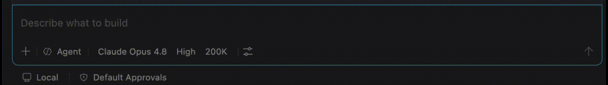

# Getting started — new to BA-Kit? Start here.

**Who this guide is for:** anyone — including if you've never used a terminal, never installed
developer tools, and don't write code. If you can copy, paste, and chat with an AI assistant, you
can do this. It takes about **20 minutes**, once, and you'll never need most of these steps again.

**What you'll end up with:** your notes and documents turned into a clean, structured requirements
document — reviewed and approved by you — by chatting with an AI assistant.

Here's the whole flow in a few seconds — slashing between the BA skills from inside the assistant:



---

## The 5 words this guide uses

You don't need to memorize these — they're explained again the first time each one matters. Just so
nothing feels unfamiliar:

| Word | In plain English |
|------|-------------------|
| **AI assistant** | The chat panel you already talk to — GitHub Copilot in VS Code, for example. BA-Kit adds new things you can ask it to do. |
| **Terminal** | A plain black-and-white window where you type a command and press Enter. You'll use it for about 2 minutes, one time, during setup. After that: never again. |
| **Project** | A folder for one piece of work (e.g. "new employee onboarding portal"). |
| **Task** | A smaller unit of work inside a project (e.g. "gather requirements from the HR team's notes"). |
| **Approve** | You reviewing an AI-written document and saying "yes, this is right" by changing one word in it. Nothing moves forward until you do this — the AI never approves its own work. |

Everything else — "artifact," "front-matter," "knowledge base" — is explained the moment you first
meet it below. There's also a full glossary at **[Concepts & glossary](concepts.md)** for later,
once you're comfortable — you don't need it to get started.

---

## Part A — One-time setup (about 20 minutes)

You only ever do this once per computer. If someone already set this up for you (or you've
installed BA-Kit before), skip to **[Part B](#part-b--your-first-project-10-minutes)**.

### A1. Check what you already have

Tick off what applies — most people are missing at most one or two of these:

- [ ] **VS Code** — a free code/text editor from Microsoft. [Download it here](https://code.visualstudio.com/)
  if you don't have it. Just run the installer like any other app.
- [ ] **GitHub Copilot** (the AI assistant) — a VS Code extension.
  1. Open VS Code.
  2. Click the **Extensions** icon in the left-hand sidebar (it looks like four squares).
  3. Search for **GitHub Copilot** and click **Install**.
  4. Click **Sign in** when prompted, and sign in with (or create) a free GitHub account.
  5. A chat panel appears — usually on the right. That's the AI assistant you'll be talking to.
- [ ] **git** — the tool that downloads BA-Kit onto your computer. You won't interact with it
  directly beyond one copy-paste command below.
  - **Windows**: download and install from <https://git-scm.com/download/win> (accept the defaults).
  - **Mac**: open the terminal (see next step) and type `git`. If it's not installed, macOS will
    offer to install it for you — click **Install**.
  - **Linux**: install it from your distro's package manager, e.g. `sudo apt install git`.

> **Prefer a different AI tool?** BA-Kit also works with Antigravity IDE, Claude, and Cursor. This
> guide focuses on VS Code + Copilot because it's the quickest path for most people. See the
> [README's supported environments](../README.md#supported-environments) for the others.

### A2. Open a terminal

The terminal is the one part of setup that isn't "point and click." You'll use it for two short
copy-paste commands, then never again.

- **Windows**: open the Start menu, type `PowerShell`, and press Enter. BA-Kit needs
  **PowerShell 7 or newer** — if you're not sure, [download it here](https://apps.microsoft.com/detail/9mz1snwt0n5d)
  and use that one (sometimes listed as "PowerShell 7" in the Start menu).
- **Mac**: open **Terminal** from Applications → Utilities (or search for it with Spotlight,
  <kbd>Cmd</kbd>+<kbd>Space</kbd>).
- **Linux**: open your distro's terminal application.

A window with text and a blinking cursor appears. That's it — that's "a terminal."

### A3. Download BA-Kit

Copy each line below, paste it into the terminal (right-click → Paste, or
<kbd>Cmd</kbd>/<kbd>Ctrl</kbd>+<kbd>V</kbd>), and press Enter. Wait for it to finish before pasting
the next line.

```sh
git clone https://github.com/aplakhotnik/bakit.git
cd bakit
```

This downloads BA-Kit into a new `bakit` folder and moves your terminal "into" it. Nothing on your
computer changes outside that one folder.

### A4. Turn on BA-Kit's commands

This connects BA-Kit's guided activities to your AI assistant, so you can type `/` and see them.

**Windows (PowerShell):**

```powershell
.\install.ps1 -Agent copilot
```

If you see a red message about "running scripts is disabled on this system," paste this first,
then run the line above again:

```powershell
Set-ExecutionPolicy -Scope Process -ExecutionPolicy Bypass
```

(This only loosens the restriction for this one terminal window — it doesn't change anything
permanently on your computer.)

**Mac / Linux:**

```sh
./install.sh --agent copilot
```

You'll see a short summary of what was installed. That's expected — it's just confirming it worked.

> **Prefer Antigravity IDE, Claude, Cursor, or picking from a menu?** See
> **[Installation reference](#installation-reference-other-agents--options)** below — same idea,
> slightly different command.

### A5. Reload VS Code and confirm it worked

1. Open the `bakit` folder in VS Code (**File → Open Folder…**, pick the `bakit` folder from step A3).
2. If VS Code asks "Do you trust the authors of the files in this folder?", click **Yes, I trust
   the authors**.
3. Reload the window: press <kbd>Cmd</kbd>/<kbd>Ctrl</kbd>+<kbd>Shift</kbd>+<kbd>P</kbd>, type
   `Reload Window`, press Enter.
4. Open the Copilot chat panel and type `/`. You should see a list that includes
   **`ba.start-project`**. That's confirmation everything is installed correctly.

Not seeing it? See the **[FAQ](faq.md)** — this is the single most common hiccup and it's a quick
fix.

**Setup is done. You will not need the terminal again** — everything from here on happens by
chatting with your AI assistant.

---

## Part B — Your first project (10 minutes)

Let's walk through a real example: imagine you've been asked to gather requirements for a new
**employee onboarding portal**. Everything below works the same for whatever you're actually
working on — just swap in your own words when you type.

### Step 1 — Start a project

In the Copilot chat panel, type:

```text
/ba.start-project
```

and tell it what you're doing, e.g. *"Start a project called employee-onboarding."*

The assistant will:
- create a folder for your project,
- ask you a few quick questions about the goal, who's involved, and anything already known — so it
  doesn't have to ask you again later. Answer what you can; skipping any question is fine.
- ask whether this is a one-off piece of work or a bigger, multi-week effort where several tasks
  will need to share knowledge. **If you're not sure, just say "the simple option"** — you can
  always upgrade later. (This is what BA-Kit calls "project mode" — not something you need to think
  hard about now.)

### Step 2 — Add a task

A **task** is one slice of the work — for our example, "gather requirements." Type:

```text
/ba.start-task
```

and say, e.g., *"Add a task: gather-requirements."* The assistant creates a small set of folders
for this task (you don't need to remember their names yet —
[Part C](#part-c--a-quick-tour-of-what-was-created) below shows you around).

### Step 3 — Give it your raw material

Do you have any existing notes, meeting minutes, emails, or documents about this work? If yes:

1. In VS Code's file explorer (left sidebar), find your task's `inputs` folder.
2. Drag and drop your files into it — Word docs, text files, PDFs exported as text, copy-pasted
   emails, anything.

No existing documents, just an idea in your head? That's fine too — skip to Step 4 and describe
what you need in plain language when asked.

### Step 4 — Ask "what's next?"

Whenever you're not sure what to do, type:

```text
/ba.next
```

It looks at what you've done so far and tells you exactly what to run next — you never have to
remember the "right" order.

- If you added documents in Step 3, it will suggest **`ba.analyze-docs`** — the assistant reads
  your documents and pulls out candidate requirements, contradictions between documents, and things
  that are still unclear.
- If you're starting from an idea rather than documents, it will suggest **`ba.specify`** directly —
  the assistant asks you a handful of focused questions and turns your answers into a structured
  requirements document.

Either way, type `/ba.next` any time you're unsure — it's always safe to ask.

### Step 5 — Review and approve

This is the one manual step you always do, and it's the most important one: **nothing the AI
writes is used for the next step until you say it's ready.**

1. Open the document the assistant just created (it will tell you the file name, something like
   `requirements.md`).
2. Read it. Edit anything you like, directly in the file — it's a plain text/Markdown file, so you
   type into it like a Word document.
3. Near the very top, you'll see a short block that looks like a label, e.g.:

   ```yaml
   status: draft
   ```

   Don't worry about the rest of that block — it's just bookkeeping the tools use. The only thing
   you ever need to do is change that one word:

   ```yaml
   status: approved
   ```
4. Save the file.

That single word change is what "approving" means everywhere in BA-Kit. Until you do it, nothing
downstream will use this document — so you're always in control, and nothing is ever silently
acted on without you.

### Step 6 — Keep going (all optional, all your choice)

Ask `/ba.next` again and it'll offer whatever makes sense next, for example:

- **`ba.write-stories`** — turns your approved requirements into user stories (the
  "as a user, I want to… so that…" format), each one traceable back to a requirement.
- **`ba.render-confluence`** — turns an approved document into a clean page ready to paste into
  Confluence or share with your team.
- A few other optional helpers exist for specific situations (e.g. a formal risk register, or a
  compliance matrix for RFP responses) — you'll find them listed in
  **[Working with the default workflow](workflows.md)** if you ever need them. You don't need them
  for a typical piece of work.

Every one of these follows the same pattern as Step 5: the assistant drafts it, you review it, you
approve it, and only then can the next step use it.

That's the whole loop. For a fuller narrative of how to work day to day, see
**[Working with the default workflow](workflows.md)**.

---

## Part C — A quick tour of what was created

Everything BA-Kit makes lives in plain text files on your computer, organized like this:

```text
bakit/
└── workspace/
    └── employee-onboarding/            ← your project
        ├── project.md                  ← the project's summary/goal
        ├── kb/                         ← background facts shared across the whole project
        └── tasks/
            └── 001-gather-requirements/     ← your task
                ├── inputs/                  ← the documents you dropped in (Step 3)
                ├── artifacts/                ← everything the AI drafts for you to review
                │   ├── docs-analysis.md          (if you ran ba.analyze-docs)
                │   └── requirements.md           ← the document you approved in Step 5
                └── deliverables/              ← polished, shareable output (e.g. a Confluence page)
```

Nothing here is a special file format — every one of these is a plain text file you can open, read,
and edit like any document. Nothing is ever deleted automatically, and re-running a step never
erases your edits or prior answers — it only adds to them.

---

## Quick answers to what you're probably wondering

**Do I need to know how to code?** No. Nothing past Part A involves a terminal, a command, or
anything resembling code.

**What if I mess something up?** You can't really — every document is just a text file, edited like
any other, and BA-Kit never deletes your work. If you're using git to track changes (optional,
common in teams), you also get a full history of every edit.

**What if I get a question I don't know the answer to?** Say so — the assistant will note it as an
open question and move on rather than guessing. You can come back to it later.

**Do I have to do this in one sitting?** No. Everything is saved to disk as you go. Close VS Code
any time and pick up later exactly where you left off — just ask `/ba.next`.

**I'm stuck / something isn't working.** See the **[FAQ & troubleshooting](faq.md)** — it covers
the most common hiccups, especially around Part A's install step.

---

## Where to go next (optional reading, once you're comfortable)

- **[Working with the default workflow](workflows.md)** — the fuller day-to-day narrative, once
  you've done the above once and want to understand the flow more deeply.
- **[Concepts & glossary](concepts.md)** — every BA-Kit term, in plain English, for reference.
- **[Worked example](../examples/README.md)** — a finished project you can look through before
  doing your own.
- **[Skills reference](../skills/README.md)** — every guided activity BA-Kit offers, listed out.
- **Upgrading BA-Kit later?** See **[Upgrading BA-Kit](#upgrading-ba-kit)** below.

---

## Installation reference (other agents / options)

Everything below is for people who already did Part A and want a different assistant, a different
install scope, or the interactive picker — you don't need any of this for a first install.

### Antigravity IDE

Workspace scope (recommended when starting):

```sh
./install.sh --agent antigravity --scope workspace
# .\install.ps1 -Agent antigravity -Scope workspace
```

Global scope (all projects on this machine):

```sh
./install.sh --agent antigravity --scope global
# .\install.ps1 -Agent antigravity -Scope global
```

### Interactive menu (choose by number)

Run the installer without `--agent` / `-Agent` to open a menu. Assistants already detected in your
folder are pre-ticked. Type number(s), press Enter, then confirm:

```text
Select the agent(s) / IDE(s) to install BA-Kit for.

  1) [x] VS Code (GitHub Copilot)
  2) [ ] Claude
  3) [ ] Cursor
  4) [ ] Generic
  5) [ ] Antigravity IDE

Your selection (default = pre-selected [x]):
```

Re-running the installer later is always safe — for any agent, any time.

### Confirming an install worked, per assistant

- VS Code: `.github/prompts/ba.start-project.prompt.md` exists
- Antigravity (workspace scope): `.agents/skills/ba.start-project/SKILL.md` exists
- Antigravity (global scope): `~/.gemini/config/skills/ba.start-project/SKILL.md` exists

The exact install location per assistant and the auto-detection rules are listed in the
[main README](../README.md#supported-environments).

### Prefer the terminal for everything?

Every scaffolding step is also available as a script, if you'd rather:

```sh
./scripts/sh/init-project.sh "payments-revamp"
./scripts/sh/init-task.sh "payments-revamp" "elicit-requirements"
./scripts/sh/next-step.sh
./scripts/sh/list-artifacts.sh "payments-revamp"
```

By default the workspace is created under `./workspace`. Override it with the `BAKIT_WORKSPACE`
environment variable.

## Upgrading BA-Kit

When a newer BA-Kit comes out, you upgrade the **whole package** and re-run the installer. Re-running
is always safe: your project folders and any installed command you hand-tuned are **backed up before**
they are replaced — nothing you changed is silently overwritten.

**1. Preview what will change (recommended).** Every install run prints a short preview first. To see
it *without writing anything*, add the dry-run flag:

```sh
./install.sh --check          # macOS / Linux
.\install.ps1 -Check          # Windows (PowerShell 7+)
```

If nothing you installed differs from the new package, you'll see **"safe to upgrade"**. Otherwise
the preview lists exactly which files differ and will be backed up.

**2. Get the newer package.**

- **Cloned the repo?** `cd bakit && git pull`.
- **Downloaded a copy?** Replace your old `bakit/` folder with the new one.

**3. Re-run the installer** (`./install.sh` or `.\install.ps1`). The end-of-run report tells you what
was `added` / `updated` / `unchanged` / `backed-up`, how many files were backed up, and where.

### Where backups go, and how to restore

If the installer is about to overwrite a command you tuned, it first copies the existing file —
verbatim — into a timestamped folder at your workspace root, then writes the new version live:

```text
.bakit-backup/
└── 20250101T120000Z/                     # UTC run timestamp (colon-free)
    └── .github/prompts/ba.next.prompt.md  # your tuned copy, mirrored install path
```

For Antigravity installs the backup mirrors the bundle path (e.g.
`.bakit-backup/<timestamp>/.agents/skills/ba.next/SKILL.md`). `.bakit-backup/` is added to your
`.gitignore` automatically.

**To restore a tuned command**, copy it back from the mirrored path inside the timestamped folder to
its install location:

```sh
cp .bakit-backup/20250101T120000Z/.github/prompts/ba.next.prompt.md .github/prompts/ba.next.prompt.md
```

> Installed `ba.*` commands that no longer match any package skill are reported as **stale** — they
> are surfaced in the report but never auto-deleted, so a renamed or custom command is never lost.

Commands not appearing, or something not working as expected? See the **[FAQ](faq.md)**.
